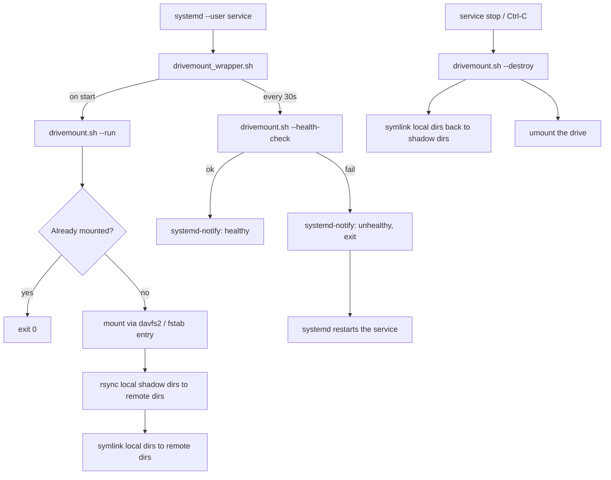

# Nextcloud / WebDAV Auto-Mount (davfs2 + systemd user service)

A small set of Bash scripts that mount a Nextcloud (or other WebDAV) share
at the **user level** via `davfs2`, replace chosen folders in your home
directory with symlinks into the mounted drive, and keep working locally
(with a sync-back via `rsync`) when the drive is unmounted or unreachable.
Everything runs as a `systemd --user` service with health checks and
automatic restarts.

- **`install.sh`** – interactive installer. Sets up `davfs2`, asks for your
  server details and folder mappings, writes the config/secrets files, and
  creates + enables the systemd user service.
- **`drivemount.sh`** (v1.2) – the main script. Mounts/unmounts the drive,
  creates the symlinks, and syncs data.
- **`drivemount_wrapper.sh`** – thin wrapper used as the systemd
  `ExecStart`. Calls `drivemount.sh`, reports readiness via
  `systemd-notify`, and polls `--health-check` in a loop.

> Currently optimized for **Nextcloud**. Other WebDAV providers may need
> manual adjustment (the WebDAV path is hardcoded to
> `/remote.php/webdav`).

## How it fits together



## Prerequisites

- A Debian/Ubuntu-based system with `apt` and `sudo` access
- `systemd` with user services available (default on most modern desktop
  distros)
- A Nextcloud (or compatible WebDAV) server and login/app-password
- `curl` (for health checks) and `rsync` (for syncing local changes back)
- `git`, to clone the repository

## 1. Get the scripts from GitHub

```bash
git clone https://github.com/<your-username>/<repo-name>.git
cd <repo-name>
chmod +x install.sh drivemount.sh drivemount_wrapper.sh
```

> Replace `<your-username>/<repo-name>` with the actual repository path.

## 2. Run the installer

```bash
./install.sh
```

`install.sh` will:

1. Ask for confirmation if you run it as root (it's meant for **per-user**
   installs, not root).
2. Install `davfs2` via `apt` and add your user to the `davfs2` group.
3. Reconfigure `davfs2` (`davfs2/suid_file` → true) so non-root users can
   mount.
4. Create `~/.local/bin` and `~/.local/share` if they don't exist.
5. Prompt you interactively for:
   - Your Nextcloud **domain** (e.g. `cloud.example.com`)
   - Your **username** and **password** for that server
   - One or more **folder mappings**: a *remote* directory (path inside
     your Nextcloud, relative to the WebDAV root) and the *local* folder
     name it should appear as in your `$HOME`. You can add as many
     mappings as you like.
6. Write your credentials to `~/.davfs2/secrets` (`chmod 600`).
7. Write `~/.local/share/drive_mount_config.sh` with your settings (see
   below).
8. Append a `noauto` mount entry for the drive to `/etc/fstab`.
9. Create `/etc/systemd/user/<username>@<domain>.service`.
10. Copy `drivemount.sh` and `drivemount_wrapper.sh` into `~/.local/bin/`.
11. Create the mountpoint directory `~/<username>@<domain>`.
12. Reload the user systemd daemon, then **enable and start** the new
    service.

### About the davfs2 group

Adding your user to the `davfs2` group only takes effect in **new** login
sessions. If the service fails on its first run with a permissions error,
log out and back in (or reboot) and try again:

```bash
systemctl --user restart <username>@<domain>.service
```

### Keep the service running after logout (optional)

User services normally stop when you log out. To allow it to keep running
(e.g. on a headless box), enable lingering for your user once:

```bash
sudo loginctl enable-linger "$USER"
```

## 3. Verify it worked

```bash
systemctl --user status "<username>@<domain>.service"
journalctl --user -u "<username>@<domain>.service" -f
```

You should see your mapped folders in `$HOME` as symlinks pointing into
`~/<username>@<domain>/...`.

## Using `drivemount.sh` manually

Once installed, you can call the main script directly instead of (or in
addition to) the systemd service:

| Flag | Action |
|---|---|
| *(no flag)* | Same as `--run` |
| `-r`, `--run` | Mounts the drive (if not already mounted), syncs local changes up, then symlinks local folders to the remote drive |
| `-d`, `--destroy` | Symlinks local folders back to local "shadow" copies and unmounts the drive |
| `-s`, `--sync` | Runs an `rsync` of the local shadow folders up to the remote drive |
| `--dry-sync` | Same as `--sync`, but as a dry run (`-auvn`, no changes made) |
| `--health-check` | Checks reachability of the remote server (used by the wrapper script's polling loop) |
| `-v`, `--version` | Prints the script version |
| `-h`, `--help` | Shows usage |

Example:

```bash
~/.local/bin/drivemount.sh --dry-sync
```

## Files written / used by these scripts

| Path | Created by | Purpose |
|---|---|---|
| `~/.davfs2/secrets` | `install.sh` | WebDAV URL + username + password (`chmod 600`) |
| `~/.local/share/drive_mount_config.sh` | `install.sh` | `mountinfo` and `dirs` associative arrays, sourced by `drivemount.sh` |
| `/etc/fstab` | `install.sh` | `noauto` entry describing the WebDAV mount |
| `/etc/systemd/user/<username>@<domain>.service` | `install.sh` | The user-level systemd unit |
| `~/.local/bin/drivemount.sh`, `drivemount_wrapper.sh` | `install.sh` (copied from the repo) | The scripts actually invoked by systemd |
| `~/<username>@<domain>/` | `install.sh` | The mountpoint for the WebDAV share |
| `~/.<localdir-lowercased>/` | `drivemount.sh` | "Shadow" folder holding your data locally while the drive is unmounted |

### Example `drive_mount_config.sh`

```bash
declare -A mountinfo
declare -A dirs

mountinfo["username"]="alice"
mountinfo["domain"]="cloud.example.com"

dirs["Documents"]="Docs"
dirs["Pictures"]="Photos"
```

With this config, `~/Documents` becomes a symlink to
`~/alice@cloud.example.com/Docs` whenever the drive is mounted, and to the
local shadow folder `~/.documents` whenever it isn't.

## Managing the systemd service

```bash
systemctl --user start   "<username>@<domain>.service"
systemctl --user stop    "<username>@<domain>.service"
systemctl --user restart "<username>@<domain>.service"
systemctl --user enable  "<username>@<domain>.service"
systemctl --user disable "<username>@<domain>.service"
systemctl --user status  "<username>@<domain>.service"
```

## Uninstalling

There's no automated uninstaller yet. To remove everything manually:

```bash
systemctl --user disable --now "<username>@<domain>.service"
rm /etc/systemd/user/<username>@<domain>.service
~/.local/bin/drivemount.sh -d        # unmount and relink to local data
rm ~/.local/bin/drivemount.sh ~/.local/bin/drivemount_wrapper.sh
rm ~/.local/share/drive_mount_config.sh
rm -r ~/.davfs2/secrets
sudo sed -i '/automatically added my drivemount install/,+1d' /etc/fstab
systemctl --user daemon-reload
```

Your data remains safe in the hidden shadow folders (`~/.<localdir>`)
after running `drivemount.sh -d`.

## ⚠️ Known issues observed in the current scripts

A few things in the uploaded scripts look like they'll cause problems and
are worth fixing/testing before relying on this for important data:

- **`drivemount.sh: run()`** — the line
  `mount_drive && directory_sync || printf "..." ; exit 1` always runs
  `exit 1` regardless of success, because the `; exit 1` is unconditional
  rather than part of the `||` chain. As written, `run()` will exit before
  reaching `set_symlinks_to_remote`, and the wrapper's
  `"$script" && systemd-notify --ready ...` will treat every run as a
  failure.
- **`drivemount.sh`** — several functions (`dir_check`,
  `set_symlinks_to_remote`, `set_symlink_to_local`, `local_files_exist`,
  `directory_sync`) reference a `$homedir` variable that is never set
  anywhere in the script (only `$HOME` is). This will likely resolve to
  empty paths.
- **`install.sh: write_config_to_files`** — the `/etc/fstab` line is
  written with the literal text `<TAB>` instead of an actual tab
  character, which will produce a malformed fstab entry.
- **`install.sh: create_mountpoint`** — uses `$mouninfo['username']`
  (typo for `mountinfo`), which won't resolve correctly.
- **`install.sh: systemd_finisher`** — calls `systemd --user ...`; this
  should be `systemctl --user ...`.
- **`install.sh: copy_executables`** — `chmod +x "${localbin_dir}/drivemount*.sh"`
  is quoted, so the `*` glob won't expand and the command will fail to
  find that literal filename.
- **`install.sh: pre_run`** — `... || printf "..." exit 1` is missing a
  `;` before `exit 1`, so `exit 1` is passed as another argument to
  `printf` instead of being executed — a failed `davfs2` install won't
  actually abort the script.
- **`install.sh: get_dir_mapping`** — uses `while $true; do`; this should
  be `while true; do` (without `$`), since `$true` expands to nothing.

None of these are addressed in this README — they're listed here so
they're easy to find and fix in the scripts themselves.

## Author

Niclas Fuchs
